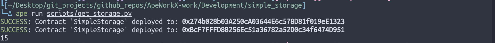

# Ape Simple Storage

## How to

1. Install [ape](https://github.com/ApeWorX/ape)

- via `pipx` or `pip`

a. Install `pipx` via their installation instructions or `pip` via their installation instructions.

b. Install ape via `pipx install eth-ape` or `pip install eth-ape`.

2. Clone the repo

```
git clone https://github.com/Aviksaikat/ApeWorkX-work
cd ApeWorkX-work/Development/simple_storage
```

3. Install the plugins

```
ape plugins install .
```

4. setup `.env` & setup `API` key & `private key`.

```
cp .env.example .env
```

5. Run the scripts.

```
ape run scripts/get_storage.py
```




## N.B. 
- Tests are broken for now. IDK how to implement them