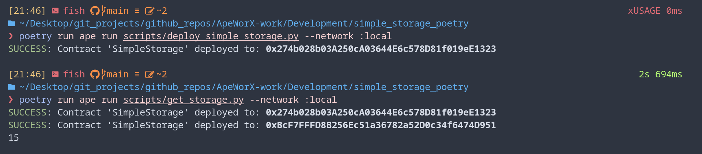

# Ape Simple Storage - Poetry(venv tool)

## Getting Started

It's recommended that you've gone through the [apeworx getting started documentation](https://docs.apeworx.io/ape/stable/userguides/quickstart.html) before proceeding here.

## Requirements

- [git](https://git-scm.com/book/en/v2/Getting-Started-Installing-Git)
  - You'll know you did it right if you can run `git --version` and you see a response like `git version x.x.x`
- [Python](https://www.python.org/downloads/)
  - You'll know you've installed python right if you can run:
    - `python --version` or `python3 --version` and get an ouput like: `Python x.x.x`
- [pip](https://pypi.org/project/pip/)
  - You'll know you did it right if you can run `pip --version` or `pip3 --version` and get an output like `pip x.x from /some/path/here (python x.x)`
- [poetry](https://python-poetry.org/docs/)
  - You'll know you did it right if you can run `poetry --version` and get an output like `Poetry version (x.x.x)`

## Quickstart

1. Clone the repo

```bash
git clone https://github.com/patrickalphac/ape-simple-storage-v23
cd ape-simple-storage-v23
```

2. Install dependencies

```bash
poetry install
poetry run ape plugins install alchemy vyper
# or
poetry shell
ape plugins install .
```

3. Deploy the contracts

```bash
poetry shell
ape run scripts/deploy_simple_storage.py
# or
poetry run ape run scripts/deploy_simple_storage.py
```

4. specify a network

```bash
poetry run ape run scripts/deploy_simple_storage.py --network :local
poetry run ape run scripts/get_storage.py --network :local
```



5. Run unit tests

```bash
# broken
poetry run pytest
```

# Usage

## Testnet - Sepolia

1. Import an account

To import an account into ape, run the following:

```bash
poetry run ape accounts import default
```

Where `default` will be the name of your account. Ape will then prompt you for your private key and password, and encrypt it on your computer. The only way to use this key moving forward will be to decrypt the key with your password.

See [this faucet](https://faucets.chain.link/) for testnet tokens.

2.  Set your RPC_URL

Since we are working with Alchemy, create an [environment variables](https://www.twilio.com/blog/2017/01/how-to-set-environment-variables.html) called `WEB3_ALCHEMY_PROJECT_ID` or `WEB3_ALCHEMY_API_KEY`. If using a linux or mac environment, you can set it by running:

```
export WEB3_ALCHEMY_PROJECT_ID=MY_API_TOKEN
```

3. Run your script!

```
poetry run ape run scripts/deploy_simple_storage.py --network ethereum:sepolia:alchemy
```

## Staging Tests

🛑 **WARNING** 🛑
_Run staging tests sparingly!_

To run staging tests, after running the above run:

```
poetry run pytest  -m "staging" --network ethereum:sepolia:alchemy --wallet-password <YOUR_DEFAULT_WALLET_PASSWORD> -s
```

This will test your contracts on a testnet.
